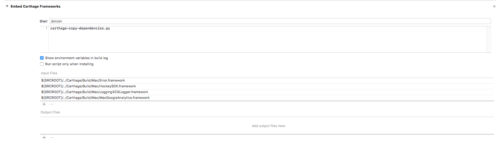

carthage-copy-dependencies
========================

# Overview

`carthage-copy-dependencies` is a carthage helper script. In an Xcode Run Script Build Phase you pass it a set of Input Files
and it automatically determines their dependencies and copies all of them into the application directory. 

# Usage

In the script text field type `carthage-copy-dependecies` and setup input files as shown in the picture.

# Note

All of the input files must reside in the same Carthage folder as the tool is looking for other dependencies in that folder.
